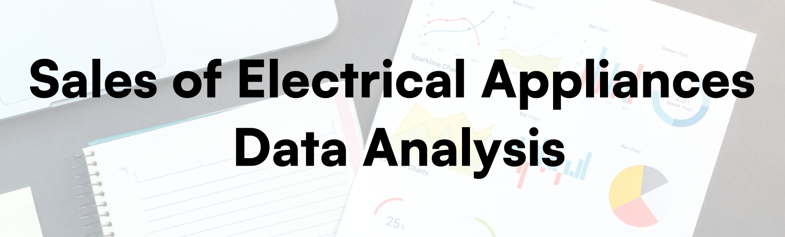

 
 

# Description of the dataset
The dataset under investigation comprises a rich collection of variables, including **Order ID**, **Order Date**, **Unit Cost**, **Price**, **Order Qty**, **Cost of Sales**, **Sales**, **Profit**, **Channel**, **Promotion Name**, **Product Name**, **Manufacturer**, **Product Sub Category**, **Product Category**, **Region**, **City**, **Country**, **Order Day**, **Order Month**, and **Order Year**. This dataset offers a unique opportunity to delve into the dynamics and trends within the electrical appliances market.This dataset is incredibly valuable for anyone interested in the retail industry or looking to make data-driven decisions about their product offerings, marketing strategies, or sales performance. By analyzing this dataset, we can gain insights into which products are most popular, which promotions are the most effective, and which regions,countries and cities are performing well or underperforming.I will be sharing visualizations and statistical analyses that provide a deeper understanding of the data, as well as identifying actionable insights that can be applied to a range of business contexts.

## Insights

- **What's the average prices for each manufacturer?**
    
- **Total Order Quantities for each Product Category**
    
- **Top 5 popular manufacturers**
    
- **How do sales and profits vary across different regions, cities, or countries?**
    
    

## Requirements 

- [Python](https://www.python.org)
- [Pandas](https://pandas.pydata.org)
- [Plotly](https://plotly.com)
- [Calendar](https://pypi.org/project/Calendar/)
- [Dataset](https://www.kaggle.com/datasets/tanmayunhale/sales-and-profit-data-for-electrical-appliances)
- [Code Editor](https://code.visualstudio.com)
